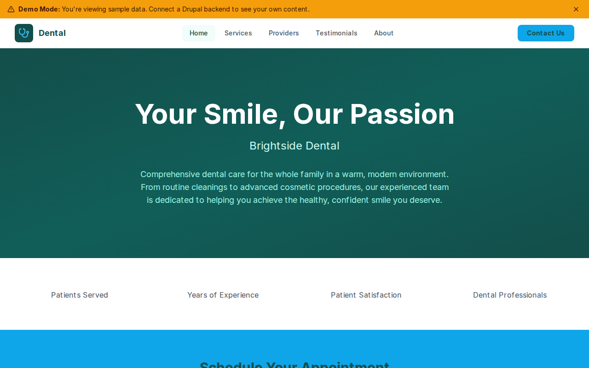

# Decoupled Dental

A dental practice website starter template for Decoupled Drupal + Next.js. Built for dentists, dental clinics, and oral healthcare providers.



## Features

- **Dental Services** - Showcase treatments with pricing, duration, insurance info, and service categories
- **Provider Profiles** - Present your dental team with credentials, specialties, education, and patient availability
- **Patient Testimonials** - Display reviews with ratings, treatment details, and patient names
- **Modern Design** - Clean, accessible UI optimized for dental practice and healthcare content

## Quick Start

### 1. Clone the template

```bash
npx degit nextagencyio/decoupled-dental my-dental-practice
cd my-dental-practice
npm install
```

### 2. Run interactive setup

```bash
npm run setup
```

This interactive script will:
- Authenticate with Decoupled.io (opens browser)
- Create a new Drupal space
- Wait for provisioning (~90 seconds)
- Configure your `.env.local` file
- Import sample content

### 3. Start development

```bash
npm run dev
```

Visit [http://localhost:3000](http://localhost:3000)

---

## Manual Setup

<details>
<summary>Click to expand manual setup steps</summary>

### Authenticate with Decoupled.io

```bash
npx decoupled-cli@latest auth login
```

### Create a Drupal space

```bash
npx decoupled-cli@latest spaces create "My Dental Practice"
```

Note the space ID returned. Wait ~90 seconds for provisioning.

### Configure environment

```bash
npx decoupled-cli@latest spaces env 1234 --write .env.local
```

### Import content

```bash
npm run setup-content
```

This imports:
- Homepage with hero section and practice statistics
- 4 dental services (Teeth Cleaning & Exams, Dental Implants, Professional Teeth Whitening, Invisalign Clear Aligners)
- 3 provider profiles (Dr. Anita Patel, Dr. Michael Chen, Dr. Rachel Johnson)
- 3 patient testimonials with ratings
- About page and New Patient Information page
- Service categories (Preventive Care, Restorative, Cosmetic, Orthodontics, Oral Surgery, Pediatric, Emergency)
- Provider roles (General Dentist, Orthodontist, Oral Surgeon, Dental Hygienist, Pediatric Dentist)

</details>

## Content Types

### Service
- **image**: Photo representing the dental service
- **summary**: Brief description of the treatment
- **duration**: Typical appointment length
- **price_range**: Cost range for the service
- **insurance_accepted**: Whether insurance covers the treatment
- **service_category**: Category taxonomy (Preventive Care, Restorative, Cosmetic, etc.)

### Provider
- **image**: Professional portrait photo
- **credentials**: Professional designations (DDS, DMD, etc.)
- **specialty**: Area of dental expertise
- **education**: Training and degree information
- **languages**: Languages spoken by the provider
- **accepting_patients**: Whether accepting new patients
- **provider_role**: Role taxonomy (General Dentist, Orthodontist, etc.)

### Testimonial
- **quote**: Patient review text
- **patient_name**: Name of the reviewing patient
- **treatment_received**: Service the patient received
- **rating**: Numeric rating score
- **date_received**: Date the testimonial was submitted

## Customization

### Colors & Branding
Edit `tailwind.config.js` to customize colors, fonts, and spacing.

### Content Structure
Modify `data/dental-content.json` to add or change content types and sample content.

### Components
React components are in `app/components/`. Update them to match your design needs.

## Demo Mode

Demo mode allows you to showcase the application without connecting to a Drupal backend.

### Enable Demo Mode

```bash
NEXT_PUBLIC_DEMO_MODE=true
```

### Removing Demo Mode

1. Delete `lib/demo-mode.ts`
2. Delete `data/mock/` directory
3. Delete `app/components/DemoModeBanner.tsx`
4. Remove `DemoModeBanner` from `app/layout.tsx`
5. Remove demo mode checks from `app/api/graphql/route.ts`

## Deployment

### Vercel (Recommended)
[](https://vercel.com/new/clone?repository-url=https://github.com/nextagencyio/decoupled-dental)

### Other Platforms
Works with any Node.js hosting platform that supports Next.js.

## Documentation

- [Decoupled.io Docs](https://www.decoupled.io/docs)
- [Next.js Documentation](https://nextjs.org/docs)
- [Drupal GraphQL](https://www.decoupled.io/docs/graphql)

## License

MIT
